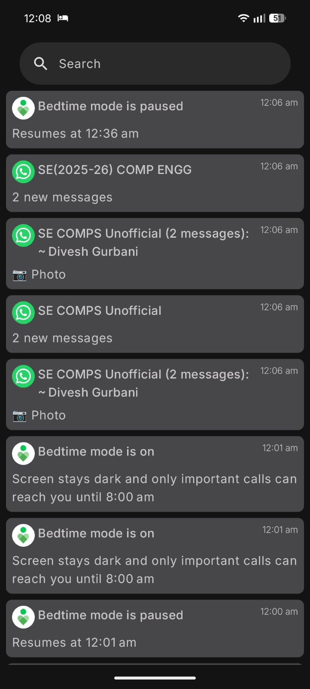

# ⭐ NotiStar

A lightweight Android app that **logs and archives all your incoming notifications** so you never miss a thing. NotiStar runs a background Notification Listener Service to capture every alert in real time and stores them persistently in a local Room database, giving you a searchable, scrollable history of everything that came in.

---

## 💡 Inspiration

This project is directly inspired by **NotiStar** — a built-in notification log feature available **natively on Samsung devices only**. Samsung's NotiStar serves the exact same purpose: it keeps a running history of all your notifications, which is especially handy for recovering **deleted messages** that you may have dismissed before reading.

After switching from a Samsung device to a **Nothing Phone**, I lost access to this native feature. Since Nothing OS doesn't ship an equivalent out of the box, I built my own — bringing the same core experience to any Android device.

---

## 📱 Screenshots



---

## ✨ Features

- **Real-time notification capture** — Intercepts alerting & conversation notifications as soon as they arrive via `NotificationListenerService`.
- **Persistent local storage** — Every notification is saved to a Room (SQLite) database so it survives app restarts.
- **Reverse-chronological feed** — The latest notifications always appear at the top.
- **Live search** — Filter your notification history by app name, title, body text, or timestamp instantly.
- **App icons** — Each notification card displays the originating app's icon via Coil image loading.
- **Permission gate** — Gracefully prompts users to grant Notification Listener access if it hasn't been granted yet.

---

## 🏗️ Architecture & Tech Stack

| Layer | Technology |
|---|---|
| **UI** | Jetpack Compose + Material 3 |
| **State management** | `StateFlow` / `collectAsStateWithLifecycle` |
| **Dependency Injection** | Dagger Hilt |
| **Local database** | Room (KSP annotation processing) |
| **Async** | Kotlin Coroutines |
| **Image loading** | Coil (`coil-compose`) |
| **Background service** | `NotificationListenerService` |

### Project Structure

```
notiStar/
└── app/src/main/java/com/example/notistar/
    ├── MainActivity.kt                          # Single-activity entry point & Compose UI
    ├── MyApplication.kt                         # Hilt application class
    ├── Services/
    │   └── NotificationListener.kt             # Background listener service
    ├── ViewModels/
    │   ├── DBContents.kt                        # Exposes notification Flow to UI
    │   └── PermissionCheck.kt                  # Tracks listener permission state
    ├── data/
    │   ├── database/
    │   │   ├── AppDataBase.kt                   # Room database definition
    │   │   ├── RoomDao.kt                       # DAO — insert & query all notifications
    │   │   └── RoomEntity.kt                    # Notification table schema
    │   └── repository/
    │       └── UpdateDBWithIncomingNotifications.kt  # Repo layer between service & DB
    ├── modules/
    │   └── DiModule.kt                          # Hilt module — provides DB & DAO singletons
    └── ui/theme/
        ├── Color.kt
        ├── Theme.kt
        └── Type.kt
```

---

## 🚀 Getting Started

### Prerequisites

- Android Studio Hedgehog (or newer)
- Android SDK **API 24** (Android 7.0) or higher
- A physical or emulated device running Android 7.0+

### Build & Run

1. **Clone the repository**
   ```bash
   git clone https://github.com/<your-username>/notiStar.git
   cd notiStar
   ```

2. **Open in Android Studio**
   - File → Open → select the `notiStar` directory.

3. **Sync Gradle**
   - Android Studio will prompt you to sync; click **Sync Now**.

4. **Run the app**
   - Select your target device and press **▶ Run**.

### Grant Notification Access

On first launch the app will detect that Notification Listener permission hasn't been granted and show a prompt. Tap **"Give app permissions"** to be taken directly to the system settings screen where you can enable **NotiStar** under *Notification access*.

---

## ⚙️ How It Works

```
Incoming notification
        │
        ▼
NotificationListenerService  ──► extracts title, body, package name, timestamp
        │
        ▼
UpdateDBWithIncomingNotifications (Repository)
        │
        ▼
Room Database  (NOTISTAR_DB / RoomEntity table)
        │
        ▼
RoomDao.getAll()  →  Flow<List<RoomEntity>>
        │
        ▼
DBContents ViewModel  →  collectAsStateWithLifecycle()
        │
        ▼
Compose UI  (reversed list + live search filter)
```

The `NotificationListenerService` is configured via the `AndroidManifest.xml` to only capture **alerting** and **conversation** category notifications, silently ignoring ongoing and silent system notifications.

---

## 🔒 Permissions

| Permission | Purpose |
|---|---|
| `BIND_NOTIFICATION_LISTENER_SERVICE` | Allows the service to read all incoming notifications |
| `CAMERA` (optional) | Declared as non-required; reserved for future features |

> ⚠️ The Notification Listener permission is a **special** system permission. Android requires users to explicitly grant it via **Settings → Apps → Special app access → Notification access**.

---

## 🛠️ Configuration

| Setting | Value |
|---|---|
| `minSdk` | 24 (Android 7.0) |
| `targetSdk` / `compileSdk` | 36 |
| `versionName` | 1.0 |
| Database name | `NOTISTAR_DB` |

---

## 🗺️ Roadmap

- [ ] Notification grouping by app
- [ ] Per-app filtering / allow-list / block-list
- [ ] Swipe-to-delete individual notifications
- [ ] Export history as CSV or JSON
- [ ] Dark / Light theme toggle
- [ ] Widget showing recent notification count

---

## 🤝 Contributing

Pull requests are welcome! For major changes, please open an issue first to discuss what you would like to change.

1. Fork the repo
2. Create your feature branch (`git checkout -b feature/amazing-feature`)
3. Commit your changes (`git commit -m 'Add amazing feature'`)
4. Push to the branch (`git push origin feature/amazing-feature`)
5. Open a Pull Request

---

## 📄 License

This project is licensed under the **MIT License** — see the [LICENSE](LICENSE) file for details.
